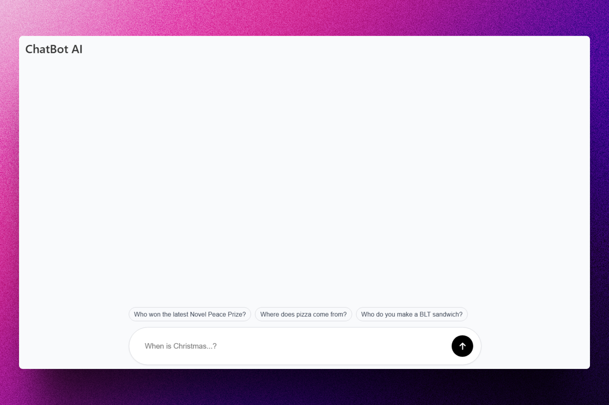
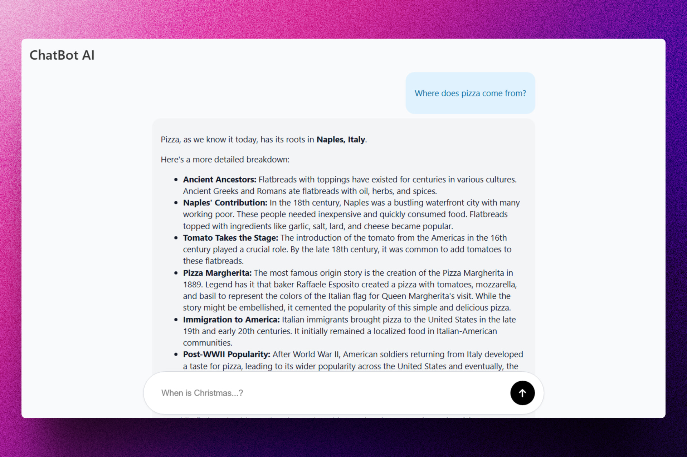

<div align='center'>

# 🤖 Preact: ChatBot AI

</div>

### Aplicación web que te permite tener una conversación con un chatbot de IA.

> 🧩 Aquí puedes ver su [**Live Demo**](https://gemini-ai-chatbot-abrahamgalue.pages.dev/).





## 🚀 Descripción

Este proyecto es un ChatBot de Inteligencia Artificial que utiliza el modelo **Gemini** de Google para responder a tus preguntas.

Utiliza la API que desarrollé [**ChatBot API**](https://chatbot-api-abrahamgalue.vercel.app/) para generar las respuestas.

## ⚡ Comenzar

### Prerrequisitos

1. Git.
2. Node.js: cualquier versión a partir de la 18 o superior.

## 🔧 Instalación

### Usando npm

1. **Clona el repositorio:**

   ```bash
   git clone https://github.com/abrahamgalue/gemini-ai-chatbot.git
   cd gemini-ai-chatbot
   ```

2. **Instala las dependencias:**

   ```bash
   npm install
   ```

### Ejecución local (modo desarrollo)

1. **Inicia el servidor de desarrollo:**

   ```bash
   npm run dev
   ```

   Esto iniciará el servidor de desarrollo de Vite y tu aplicación estará disponible en `http://localhost:5173`.

### Ejecución local (modo producción)

1. **Compila la aplicación para producción:**

   ```bash
   npm run build
   ```

   Esto generará una versión optimizada de tu aplicación en la carpeta `dist`.

2. **Inicia el servidor de producción:**

   ```bash
   npm run preview
   ```

   Esto iniciará un servidor local para que puedas probar la versión de producción de tu aplicación. La aplicación estará disponible en `http://localhost:4173`.

## 🎭 Tecnologías

- [**Preact**](https://preactjs.com/) Para construir la interfaz de usuario y hacer SSR con SSG.
- [**Vite**](https://vite.dev/) Como bundler para el proyecto.
- [**react-markdown**](https://www.npmjs.com/package/react-markdown) Para renderizar el texto en formato Markdown.
- [**Cloudflare**](https://www.cloudflare.com/) Para desplegar la aplicación web.
